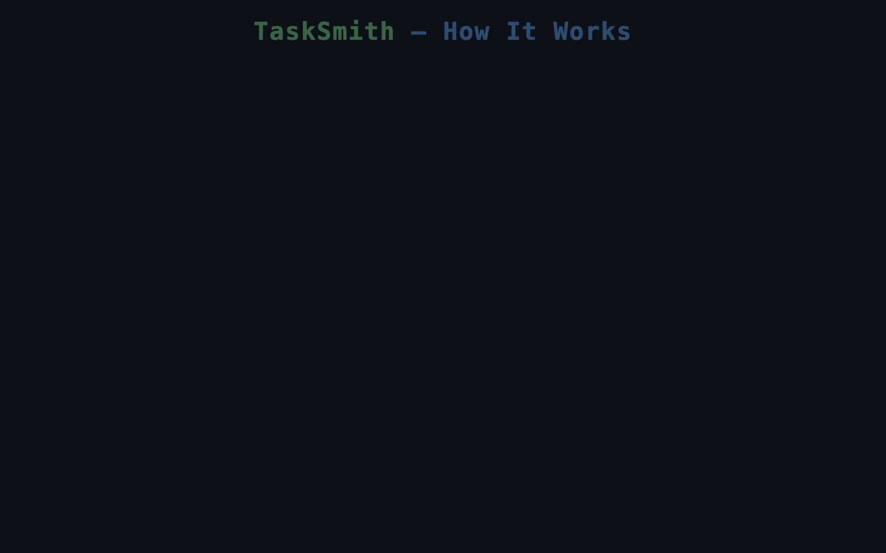

# TaskSmith

Multi-agent orchestration framework that decomposes complex requests into isolated DAG nodes and executes them with topological scheduling.



## How It Works

1. **Plan** — Write a natural-language plan describing what needs to be done
2. **Build DAG** — Each task becomes a node with explicit dependencies, forming a directed acyclic graph
3. **Execute** — A scheduler dispatches ready nodes in parallel waves, following topological order
4. **Complete** — All nodes finish with full isolation between workers

## Key Concepts

- **Session isolation** — Each node executes in a fresh session with no shared context
- **Wave-based scheduling** — Nodes with satisfied dependencies run in parallel
- **Failure propagation** — Upstream failures automatically block downstream nodes
- **Incremental planning** — DAG can be built and mutated during execution

## Architecture

```
plan.md → Clarifier → DAG Builder → Scheduler → Workers
                                        ↑           |
                                        └── Evaluator ←┘
```

## License

MIT
